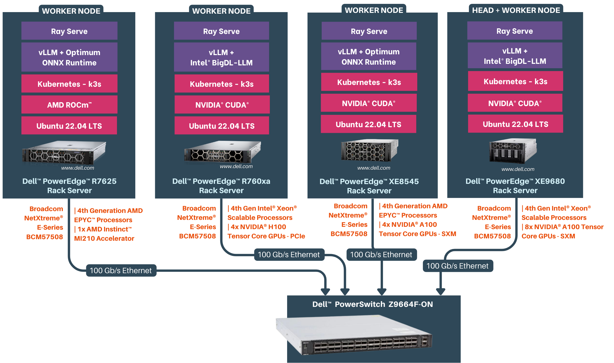
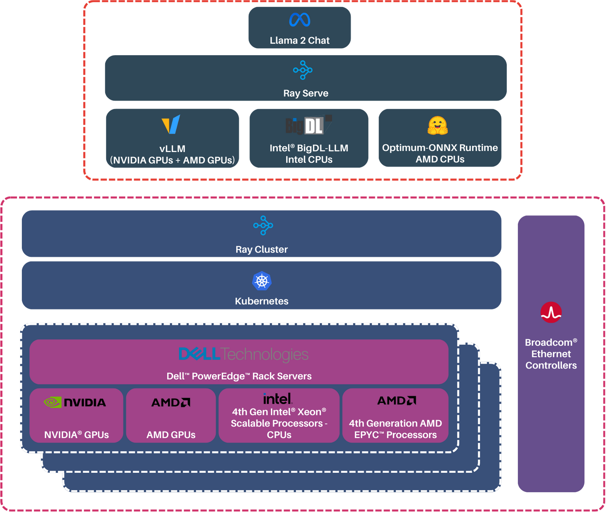

# Scaling Inference for Large Language Models: Embracing Heterogeneous Hardware

## Table of Contents

1. [Introduction](#introduction)
2. [Prerequisites](#prerequisites)
3. [Overview of Set Up](#overview-of-setup)
4. [Detailed Set Up Guide](#detailed-set-up-guide)
5. [Further Reading](#further-reading)

## Introduction

Serve Llama 2 (7B/13B/70B) Large Language Models efficiently at scale by leveraging heterogeneous Dell PowerEdge servers in a distributed manner.

The developer documentation provides a comprehensive guide for serving [Llama 2 Large Language Models (LLMs)](https://ai.meta.com/llama/) in a distributed environment, using [Dell PowerEdge servers](https://www.dell.com/en-in/work/shop/dell-poweredge-servers/sc/servers) networked with [Broadcom Ethernet Network Adapters](https://www.broadcom.com/products/ethernet-connectivity/network-adapters). This document aims to empower developers with the knowledge and tools necessary to serve LLMs for maximum inference performance by creating GPU and CPU clusters . By leveraging the computational power of [Dell PowerEdge servers](https://www.dell.com/en-in/work/shop/dell-poweredge-servers/sc/servers), networking capability of [Broadcom Ethernet Network Adapters](https://www.broadcom.com/products/ethernet-connectivity/network-adapters) and the scalability with Kubernetes, developers can efficiently serve LLMs to meet their application requirements.

  

## Prerequisites

### Software Requirements

Before we start, make sure you have the following software components set up on your Dell PowerEdge servers:

* Ubuntu Server 22.04, with kernel v5.15 or higher
* [Docker v24.0 or later](https://docs.docker.com/engine/install/ubuntu/)
* [NVIDIA CUDA Toolkit v12.2.1](https://docs.nvidia.com/cuda/cuda-toolkit-release-notes/index.html)

### Hardware Requirements

Additionally, ensure you have the following hardware components at your disposal:

* [Dell PowerEdge Servers](https://www.dell.com/en-in/work/shop/dell-poweredge-servers/sc/servers) equipped with [NVIDIA GPUs](https://www.nvidia.com/en-in/data-center/data-center-gpus/) / [AMD GPUs](https://www.amd.com/en/solutions/data-center/data-center-ai-premiere.html).

## Overview of Setup
### 1. Setting up a Distributed Cluster

*Estimated Time: 40 mins ⏱️*

To set the stage for distributed inferencing, we'll start by configuring our cluster with precision. Using [Kubernetes](./docs/cluster_setup.md#k3s-setup-on-server-and-agent-nodes) as our orchestration system, we'll establish a cluster comprising of a designated [server/head node](./docs/cluster_setup.md#server-node-setup) node and multiple [agent/worker nodes](./docs/cluster_setup.md#agent-node-setup) nodes. The flexibility lies in your hands: you can choose to include the head node in the distributed inferencing process or opt for an additional worker node on the same machine as the head node, enhancing the power of your computational setup.

To optimize our resources further, we'll integrate [Nvidia device plugins for Kubernetes](./docs/cluster_setup.md#nvidia-device-plugins-for-kubernetes)  and [AMD device plugins for Kubernetes](./docs/cluster_setup.md#amd-device-plugins-for-kubernetes) using [Helm](./docs/cluster_setup.md#installing-helm).

This streamlined integration ensures that our distributed inferencing environment is equipped with the necessary acceleration capabilities.

### 2. KubeRay Installation and Ray Cluster Configuration

*Estimated Time: 40 mins ⏱️*

We'll be introducing [KubeRay](./docs/raycluster_setup.md#kuberay-installation) to our Kubernetes cluster. This step guarantees a robust and scalable infrastructure for our distributed inference.

## 3. Serving the Llama 2 70B Model

*Estimated Time: 1hr 10 mins ⏱️*

We will be executing the distributed inference of the cutting-edge [Llama 2 70B](./docs/serving_llm.md#serving-llm-models) model developed by Meta AI. To accomplish this, we're harnessing the power of robust tools such as: [Ray Serve](https://github.com/ray-project/ray) and inferencing backend optimized for the available hardware cluster, ensuring an efficient and scalable workflow.

  

## 4. Monitoring Cluster and Serving

The [Ray Dashboard](./docs/dashboards.md) offers real-time insights into serving. Accessible at http://127.0.0.1:30265, this dashboard grants you access to the **Serve** tab, allowing you to monitor serve applications deployed and its logs. Meanwhile, the **Cluster** tab provides a comprehensive overview of device statistics across your cluster, ensuring you're always in control.

The [Grafana Dashboard](./docs/dashboards.md) empowers you with comprehensive system and cluster metrics. Every dashboard provides in-depth insights into Kubernetes cluster and Node-level metrics, offering a seamless way to monitor and troubleshoot your nodes and deployments.

## 5. Running Inference with Chatbot

Use the application end point to [run a chatbot](./infer/README.md) using Gradio.

## Detailed Set Up Guide

This comprehensive guide will walk you through every step, from setting up a powerful Kubernetes cluster to performing inference on the Llama 2 model and evaluating its performance.

* [Setting up a Distributed Cluster](./docs/cluster_setup.md#setting-up-a-distributed-cluster)
    * [K3S Setup on Server and Agent Nodes](./docs/cluster_setup.md#k3s-setup-on-server-and-agent-nodes)
    * [Installing Helm](./docs/cluster_setup.md#installing-helm)
    * [AMD Device Plugins for Kubernetes](./docs/cluster_setup.md#amd-device-plugins-for-kubernetes)
    * [NVIDIA Device Plugins for Kubernetes](./docs/cluster_setup.md#nvidia-device-plugins-for-kubernetes)
* [KubeRay Installation And Configuration](./docs/raycluster_setup.md#kuberay-installation-and-ray-cluster-configuration)
    * [KubeRay Installation](./docs/raycluster_setup.md#kuberay-installation)
    * [Creating Kubernetes Secrets](./docs/raycluster_setup.md#creating-image-pull-secret-for-kubernetes)
    * [Our Test Cluster for Llama 2 70B Inferencing](./docs/raycluster_setup.md#our-test-cluster-for-llama-2-70b-inferencing)
* [Serving Llama 2](./docs/serving_llm.md#serving-llm-models)
    * [Inference Serving Optimizations](./docs/serving_llm.md#inference-serving-optimizations)
    * [Prerequisites](./docs/serving_llm.md#prerequisites)
    * [Ray Cluster Configuration](./docs/serving_llm.md#ray-cluster-configuration)
    * [Serving Llama 2 70B Chat on GPUs](./docs/serving_llm.md#serving-llama-2-70b-chat-on-gpus)
        * [Building Serving Docker Images](./docs/serving_llm.md#building-serving-docker-images)
        * [Deployment Configuration](./docs/serving_llm.md#deployment-configuration)
            * [Ray Cluster Configuration](./docs/serving_llm.md#ray-cluster-configuration-1)
            * [Serve application Configuration](./docs/serving_llm.md#serve-application-configuration)
            * [Deploying Ray Cluster](./docs/serving_llm.md#deploying-ray-cluster)
    * [Serving Llama 2 7B Chat on CPUs](./docs/serving_llm.md#serving-llama-2-7b-chat-on-cpus)
        * [Building Serving Docker Images](./docs/serving_llm.md#building-serving-docker-images-1)
        * [Deployment Configuration](./docs/serving_llm.md#deployment-configuration-1)
            * [Ray Cluster Configuration](./docs/serving_llm.md#ray-cluster-configuration-2)
            * [Serve application Configuration](./docs/serving_llm.md#serve-application-configuration-1)
            * [Deploying Ray Cluster](./docs/serving_llm.md#deploying-ray-cluster-1)
    * [Accessing Dashboards](./docs/serving_llm.md#accessing-dashboards)
* [Chatbot for inference on Llama 2 Model](./serving/chatbot/README.md)

## Further Reading

To gain a comprehensive understanding of every facet involved in serving a Large Language Model (LLM), explore the following resources:

| Resource | Details |
| --- | --- |
| [Llama 2 LLM Model](./docs/model_details.md) | Explore the intricacies of the advanced Llama 2 LLM model. |
| [Ray Serve](./docs/ray_serve.md) | Gain insights into the popular and open-source serving technologies currently in use. |
| [Ray Service](./docs/ray_service.md) | Delve into the capabilities of Ray Service, a cutting-edge open-source technology for distributed computing, providing robust scalability and performance for complex applications |
| [vLLM](./docs/vllm.md) |Explore the capabilities of vLLM, an innovative open-source serving technology for Large Language Models (LLMs), offering superior throughput and efficiency. |
| [Intel BigDL](./docs/intel_bigdl.md) |Dive into the capabilities of Intel BigDL, an open-source deep learning library that brings powerful optimization techniques and high-performance computing to large language models on Intel hardware|
| [Optimum ONNXRuntime](./docs/optimum_onnxruntime.md) |Uncover the capabilities of Optimum ONNXRuntime, a utility package designed for building and running inference with accelerated runtime like ONNX Runtime, providing advanced optimization techniques for improved model performance and efficiency |
