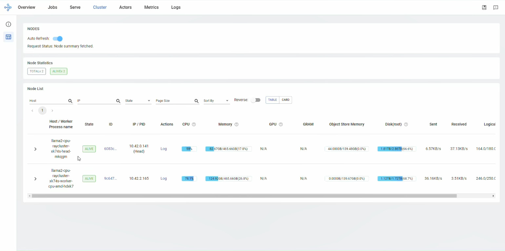
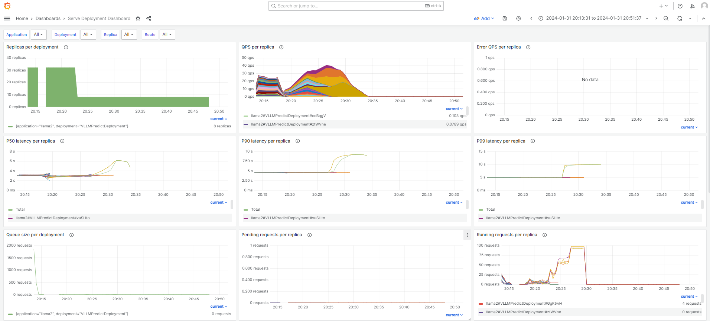
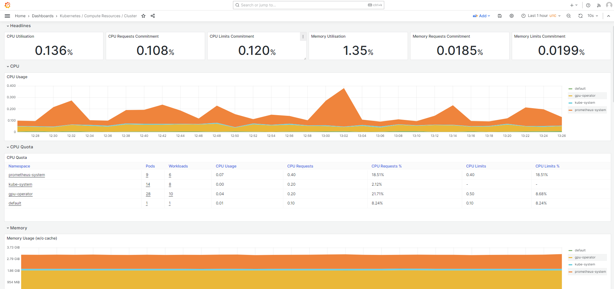
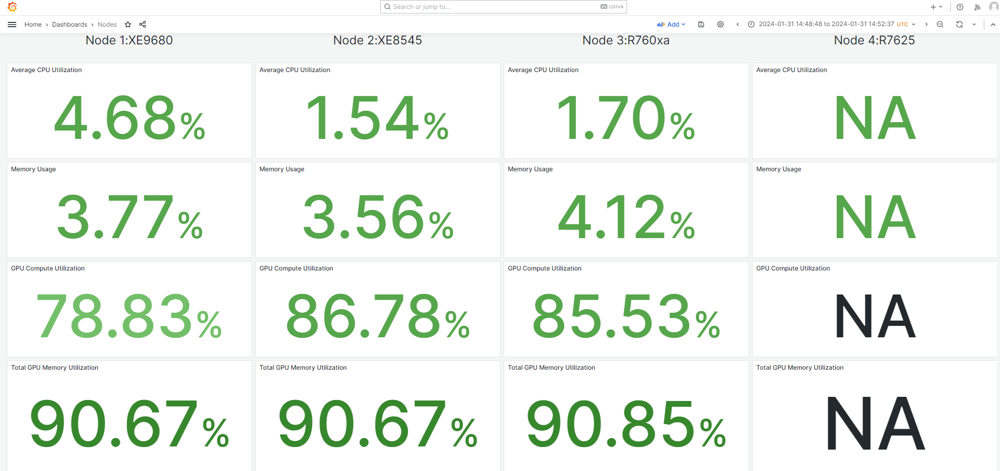

# Dashboards

You can access all details regarding your cluster and serving deployment through dashboards.

## Accessing the Ray Dashboard

Ray provides a web-based [Ray Dashboard](https://docs.ray.io/en/latest/ray-observability/getting-started.html) for monitoring and debugging Ray Cluster. The visual representation of the system state allows users to track the performance of the cluster and troubleshoot issues.

1. Once all the cluster pods are running, the ray cluster dashboard is accessible at the [localhost:30265](http://localhost:30265).

2. The **Cluster** section provides the details of all the nodes connected to the cluster.

    
    <figcaption style="text-align:justify; font-style:italic;">Fig 3. Cluster Section of the Ray Dashboard showing details of the cluster. </figcaption>

## Accessing the Grafana Dashboard

### Accessing the Cluster level Dashboards
The cluster level Grafana dashboards are accessible at the [localhost:3000](http://localhost:3000).

  
  <figcaption style="text-align:justify; font-style:italic;">Fig 4. Serve Deployment Dashboard. </figcaption>

  
  <figcaption style="text-align:justify; font-style:italic;">Fig 5. Kubernetes Cluster Dashboard. </figcaption>

### Accessing the Node level Dashboards
The node level Grafana dashboards are accessible at the [localhost:3000](http://localhost:3000).

  
  <figcaption style="text-align:justify; font-style:italic;">Fig 6. Node level Dashboard. </figcaption>
