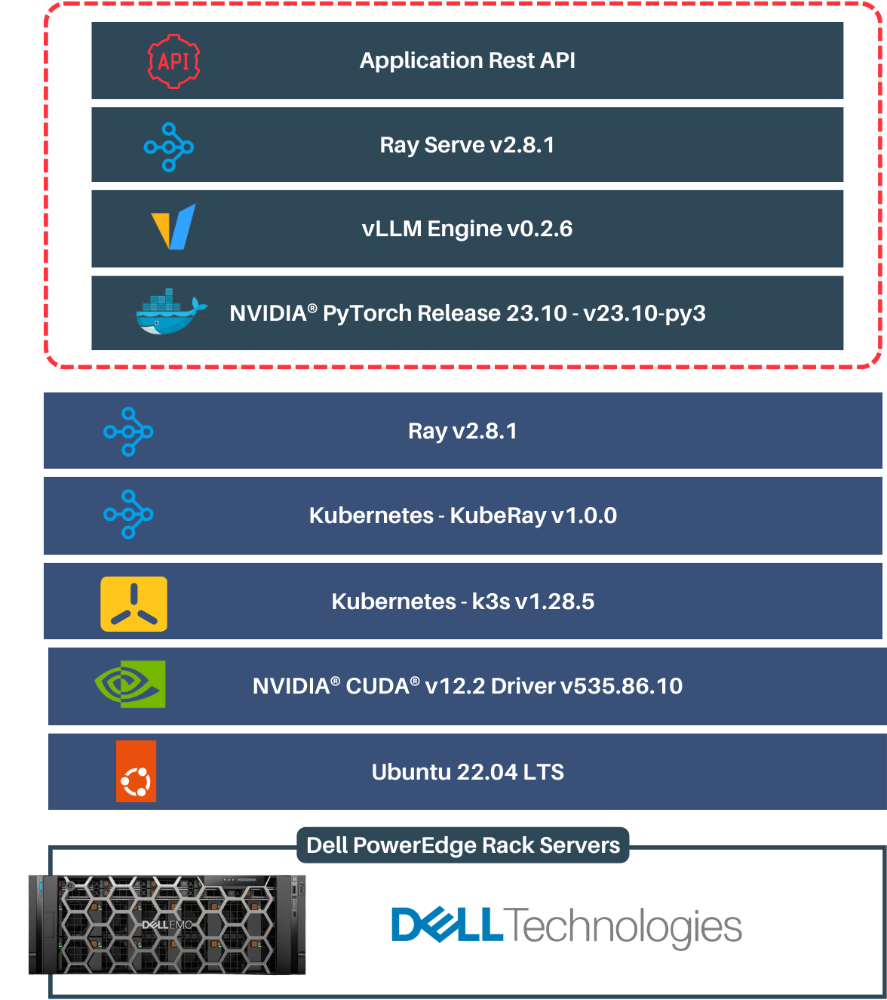
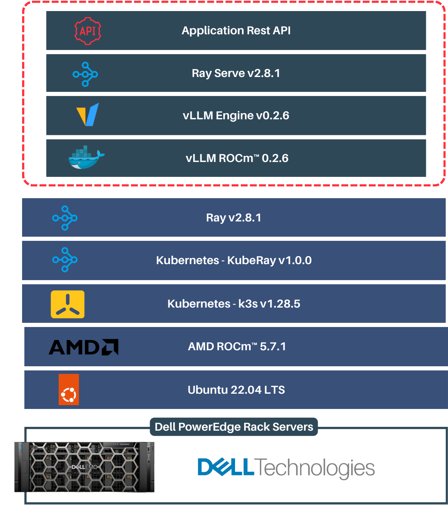
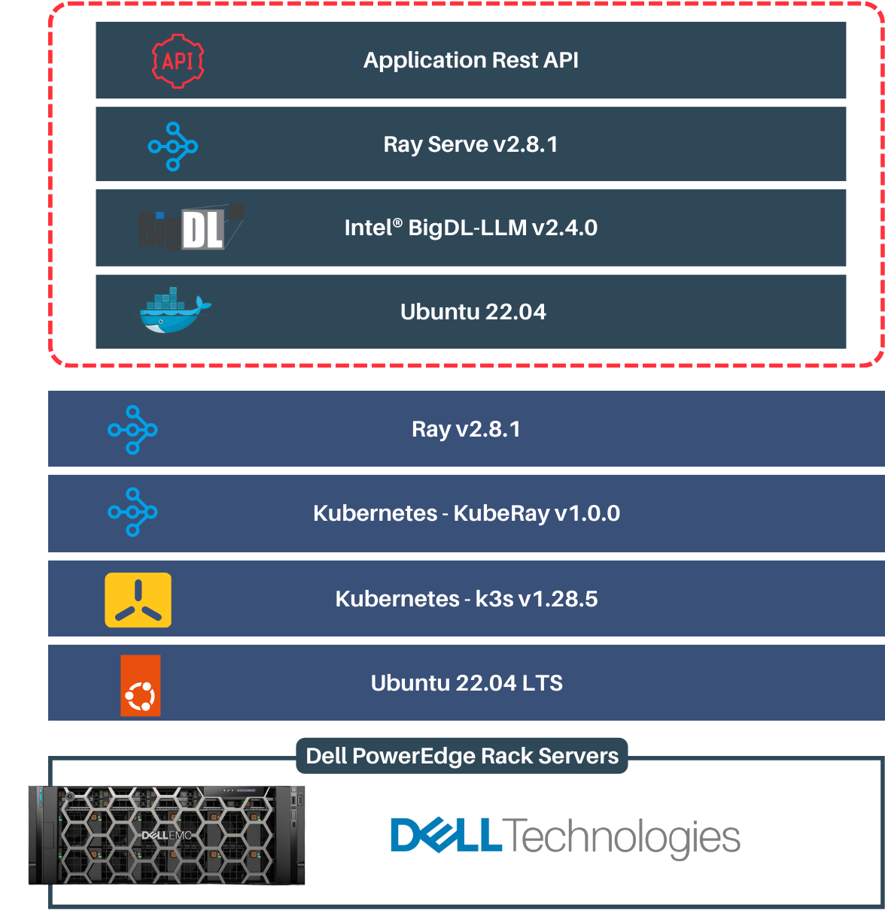
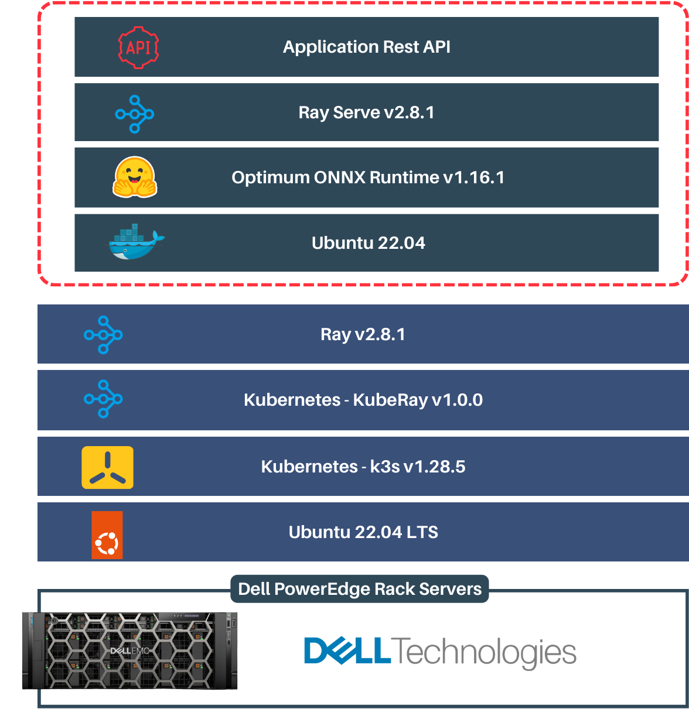

# Serving LLM Models

Lets deploy the Llama 2 70B Chat model on our cluster.


## Table of Contents

* [Inference Serving Optimizations](#inference-serving-optimizations)
    * [NVIDIA GPUs](#nvidia-gpu)
    * [AMD GPUs](#amd-gpus)
    * [Intel CPUs](#intel-cpus)
    * [AMD CPUs](#amd-gpus)
* [Prerequisites](#prerequisites)
* [Ray Cluster Configuration](#ray-cluster-configuration)
* [Serving Llama 2 70B Chat on GPUs](#serving-llama-2-70b-chat-on-gpus)
    * [Building Serving Docker Images](#building-serving-docker-images)
    * [Deployment Configuration](#deployment-configuration)
        * [Ray Cluster Configuration](#ray-cluster-configuration-1)
        * [Serve application Configuration](#serve-application-configuration)
        * [Deploying Ray Cluster](#deploying-ray-cluster)
* [Serving Llama 2 7B Chat on CPUs](#serving-llama-2-7b-chat-on-cpus)
* [Building Serving Docker Images](#building-serving-docker-images-1)
    * [Deployment Configuration](#deployment-configuration-1)
        * [Ray Cluster Configuration](#ray-cluster-configuration-2)
        * [Serve application Configuration](#serve-application-configuration-1)
        * [Deploying Ray Cluster](#deploying-ray-cluster-1)
* [Accessing Dashboards](#accessing-dashboards)


## Inference Serving Optimizations

Optimized libraries enable the functionality of each hardwares.

### NVIDIA GPU

The NVIDIA GPUs inference is enabled by vLLM (v0.2.6).



The Ray Serve is integrated with vLLM asynchronous engine.
vLLM is a high-throughput and memory-efficient inference and serving engine for Large Language Models (LLMs). vLLM provides efficient management of attention key and value memory with PagedAttention and  continuous batching of incoming requests. It supports seamless integration with popular HuggingFace models and offers high-throughput inference.

### AMD GPUs

The NVIDIA GPUs inference is enabled by vLLM-ROCm (v0.2.6).




vLLM ensures fast model execution with ROCm (HIP graph), and when combined with Ray Serve, vLLM can be used to create a scalable service for fast and scalable LLM serving.

### Intel CPUs

The Intel CPUs inference is enabled by BigDL-LLM (v2.4.0)



BigDL-LLM is a library developed by Intel Analytics which can accelerate LLMs using low-precision (INT4/INT5/INT8) techniques, modern hardware accelerations, and the latest software optimizations. It can run any Hugging Face Transformers PyTorch model with minimal code changes, resulting in significant speedup.

### AMD CPUs



Optimum is a library developed by Hugging Face that provides optimized versions of transformer models, which are designed to provide faster inference times and lower memory usage. ONNX Runtime, on the other hand, is a performance-focused engine for executing machine learning models in the ONNX (Open Neural Network Exchange) format. Combining Optimum and ONNX Runtime can result in significantly improved inference times and reduced memory usage for transformer models.


## Prerequisites
* [HuggingFace API Token](https://huggingface.co/docs/hub/security-tokens)
* [Access to Llama 2 Models](https://huggingface.co/meta-llama)


## Ray Cluster Configuration

The [Ray cluster](https://docs.ray.io/en/latest/cluster/key-concepts.html#ray-cluster) is defined by the cluster deployment yaml [cluster.nvidia.yaml](../serving/gpu/cluster.nvidia.yml). Refer to the detailed configuration below to customize the cluster settings according to your hardware availability.

> Note: Note: To know more about the Ray Cluster Configurations on Kubernetes, refer [RayCluster Configuration page](https://docs.ray.io/en/latest/cluster/kubernetes/user-guides/config.html#kuberay-config).

```yaml
rayVersion: "2.3.0"
    ...
headGroupSpec:
rayStartParams:
    dashboard-host: "0.0.0.0"
    # setting `num-gpus` on the rayStartParams enables
    # head node to be used as a worker node
    num-gpus: "8"
    ...
template: # Pod template
    metadata: # Pod metadata
    labels:
        name: ray-head # label for adding node port service
    spec: # Pod spec
        runtimeClassName: nvidia # Runtime to enable NVIDIA GPU access
        containers:
        - name: ray-head
            image: infer.cr.io/infer:latest # Serving docker image
            resources:
            limits:
                cpu: 50 # Number of CPU cores allocated
                memory: 500Gi # Memory allocated
                nvidia.com/gpu: 8 # Number of NVIDIA GPUs allocated
                ...
            requests:
                cpu: 14
                memory: 500Gi
                nvidia.com/gpu: 8
                ...
            # Keep this preStop hook in each Ray container config.
            lifecycle:
            preStop:
                exec:
                command: ["/bin/sh","-c","ray stop"]
            volumeMounts:
            - name: nfs-pv
            mountPath: /models # NFS mount path
    volumes:
    - name: nfs-pv
        persistentVolumeClaim:
        claimName: nfs-pvc
    imagePullSecrets:
    - name: cr-login # Image pull secret
    ...
workerGroupSpecs:
- groupName: gpu-group
replicas: 2 # Available agent nodes
minReplicas: 2 # Available agent nodes
maxReplicas: 5
rayStartParams:
    num-gpus: "4"
    ...
template: # Pod template, same as head group
    spec:
    ...
# Another workerGroup
- groupName: medium-group
...
---
# The ray dashboard is configured as node port on 30265
# Ray dashboard port(8265) service
apiVersion: v1
kind: Service
metadata:
  name: ray-head-dashboard-port
spec:
  selector:
    name: ray-head
  type: NodePort
  ports:
  - port: 8265
    targetPort: 8265
    nodePort: 30265 # the ray dashboard is accessible at this port
```

## Serving Llama 2 70B Chat on GPUs

To deploy the Llama 2 70B Chat models on GPUs(NVIDIA/AMD) refer this section.


### Building Serving Docker Images

Follow the below steps to build and push the docker images to a container registry for inferencing.

1. Build the docker image.

    i. The below example is for building Nvidia GPU docker image

      ```sh
      cd serving/gpu
      sudo docker build -t infer:latest -f Dockerfile.nvidia .
      ```
      <details>
      <summary>Build AMD Docker Image</summary>
      To build an AMD GPU Docker image, utilize the previous commands by
      replacing the Dockerfile name to Dockerfile.amd.
      </details>

2. Tag the docker images with container registry URI.
    > *Note: The tag should be based on your container registry name*

    > *Note: The tag should align with the image name*

    ```sh
    sudo docker tag infer:latest <container registry>/infer:latest
    ```

    Update the `<container registry>` with your container registry URI.

3. Push the docker images to container registry.

    ```
    sudo docker push <container registry>/infer:latest
    ```

    Update the `<container registry>` with your container registry URI.


### Deployment Configuration

The Kubernetes deployment configuration has two parts

* Ray Cluster Configuration
* Serve application Configuration

#### Ray Cluster Configuration

The Ray cluster needs to configured based on the hardware availability for the serving deployment.

Refer the [Ray Cluster Configuration](#ray-cluster-configuration) for more details.

The [cluster.nvidia.yml](../serving/gpu/cluster.nvidia.yml) available on the repository follows the below configuration for the ray cluster.

| Node ID | <b>Type of Node | | Allocations<b> |  | |
| -- | --- | -- | -- | -- | -- |
|  | | <b>CPU<b> | <b>Memory</b> | <b>Disk</b> | <b>GPU</b> |
| Node 1 | Head |  160 | 300GB | 2TB | 8 |
| Node 2 | Worker |  160 | 300GB | 1TB | 4 |
| Node 3 | Worker |  160 | 300GB | 1TB | 4 |

#### Serve application Configuration

Ray Serve configurations allows you to fully configure everything related to Serve, including system-level components like the proxy and application-level options like individual deployment parameters.

The serve configuration used in deploying Llama 2 70B Chat model on NVIDIA GPU is as follows

```yaml
proxy_location: HeadOnly
http_options:
    host: 0.0.0.0
    port: 8000
applications:
    - name: llama2
    import_path: inference.typed_app_builder
    route_prefix: /
    args:
        gpu_count: 4
        model_name: "<Model Name/Path>"
        data_type: bfloat16
        batch_size: 256
        hf_token: <add hugging token here>
    deployments:
    - name: VLLMPredictDeployment
        num_replicas: 4
        max_concurrent_queries: 256
        ray_actor_options:
            num_cpus: 20
```

The configuration contains the below fields

* `proxy_location`
* `http_options`
* `applications`


The `proxy_location` field configures where to run proxies to handle traffic to the cluster. Supported values are below

* EveryNode (default)
* HeadOnly
* Disabled

> For more information refer [`proxy_location` on Serve Config Files](https://docs.ray.io/en/latest/serve/production-guide/config.html)

`http_options` in Ray Serve encompasses global configurations for the cluster's HTTP settings crucial for managing deployment exposure and request handling. Includes the below options

* `host` for the Serve's HTTP proxies' IP address.
* `port` for the proxy port (defaulted to 8000) .
* `request_timeout_s` to set end-to-end request timeout.
* `keep_alive_timeout_s` for customizing the HTTP proxy's keep-alive timeout.

The `application` is defined by the serving deployed.

* `name` The names for each serving application.
* `import_path` defines the serve deployment file path with serve object.

    ```<serving script>:<serving object>```
* `runtime_env`: Defines the environment that the application runs in.
* `route_prefix`: The deployed application can be called via HTTP at the specified route prefix.
* `args`: Arguments passed to serve application builder.

    The below arguments are supported by the serve application.

    *  `gpu_count`: Tensor Parallelism
    * `model_name`: HuggingFace model name or NFS Path
    * `data_type`: Data type for inference. Supported precisions are

        * `bfloat16`
        * `float16`
        * `float32`
        * `auto`
        * `half`
        * `float`
    * `batch_size`: Batch size for inference.
    * `batch_wait_timeout_s`: Defined how long serve should for a batch once first request arrives.
    * `hf_token`: HuggingFace token for the Llama 2 model access.

* `deployments`: The serve deployments can be configurations controls resource management, performance tuning and scaling behaviour. For detailed configuration details refer [Configure Ray Serve deployments](https://docs.ray.io/en/latest/serve/configure-serve-deployment.html#serve-configure-deployment).


### Deploying Ray Cluster

1. Update the [cluster.yml](../serving/gpu/cluster.nvidia.yml) by following the configurations described above.
1. Once the cluster is configured, deploy to the k3s cluster

    ```sh
    cd serve/gpu
    kubectl apply -f cluster.nvidia.yml
    ```
    >*Note: The pods might take more than 10 mins to start running based on the system's network speed.*
3. Verify the inferencing pods running on all of the k3s nodes.

    ```sh
    kubectl get po -o wide
    ```
    Wait until all the pods are at `Running` state before continuing.

    ```sh
    NAME                                READY   STATUS    RESTARTS       AGE   IP           NODE     NOMINATED NODE   READINESS GATES
    kuberay-operator   1/1     Running   0              1h   10.42.0.15   xe9680   <none>           <none>
    raycluster-head-5lbx4               1/1     Running   0              10m   10.42.0.32   xe9680   <none>           <none>
    raycluster-worker-gpu1-dsd23   1/1     Running   0              10m   10.42.1.21   xe8545   <none>           <none>
    raycluster-worker-gpu2-df4sa   1/1     Running   0              10m   10.42.1.10   r760xa   <none>           <none>
    ```


## Serving Llama 2 7B Chat on CPUs

To deploy the Llama 2 70B Chat models on CPUs(Intel/AMD) refer this section.

### Building Serving Docker Images

Follow the below steps to build and push the docker images to a container registry for inferencing.

1. Build the docker image.

    i. The Intel CPU Docker Image

      ```sh
      cd serving/cpu/intel
      sudo docker build -t infer_cpu:latest -f Dockerfile.intel .
      ```
    ii. The AMD CPU Docker image

    * Convert the Llama 2 7B model to ONNX format.
        ```sh
        cd serving/amd/model_conversion
        bash install_requirements.txt
        python3 model_conversion.py
        ```
    * Once the model is converted copy the Llama 2 int8 model to your NFS directory setup [here](./cluster_setup.md#network-file-system-nfs-setup)
    * Build the image
        ```sh
        cd serving/cpu/amd
        sudo docker build -t infer_cpu:latest -f Dockerfile.amd .
        ```
2. Tag the docker images with container registry URI.
    > *Note: The tag should be based on your container registry name*

    > *Note: The tag should align with the image name*

    ```sh
    sudo docker tag infer:latest <container registry>/infer:latest
    ```

    Update the `<container registry>` with your container registry URI.

3. Push the docker images to container registry.

    ```
    sudo docker push <container registry>/infer:latest
    ```

    Update the `<container registry>` with your container registry URI.

### Deployment Configuration

The Kubernetes deployment configuration has two parts

* Ray Cluster Configuration
* Serve application Configuration

#### Ray Cluster Configuration

The Ray cluster needs to configured based on the hardware availability for the serving deployment.

Refer the [Ray Cluster Configuration](#ray-cluster-configuration) for more details.

The [cluster.cpu.yml](../serving/cpu/cluster.cpu.yml) available on the repository follows the below configuration for the ray cluster.

| Node ID | <b>Type of Node | | Allocations<b> |  | |
| -- | --- | -- | -- | -- | -- |
|  | | <b>CPU<b> | <b>Memory</b> | <b>Disk</b> | <b>Manufacturer</b> |
| Node 1 | Head |  224 | 1TB | 2TB |  Intel |
| Node 2 | Worker | 256   | 1TB | 1TB | AMD|
| Node 3 | Worker | 224  | 1TB | 1TB | Intel |
| Node 4 | Worker |  128 | 1TB | 1TB | AMD |


#### Serve application Configuration

> For more detailed options available for serve configuration refer [Serve Application Configuration under GPU](#serve-application-configuration)

The serve configuration used in deploying Llama 2 70B Chat model on NVIDIA GPU is as follows

```yaml
proxy_location: HeadOnly
    http_options:
      host: 0.0.0.0
      port: 8001
    applications:
      - name: llama2-cpu-intel
        import_path: inference:typed_app_builder
        route_prefix: /cpu
        args:
          model_name: "<Model Path>" # add model path here
          data_type: int8
          batch_size: 1
          hf_token: <HF_TOKEN> # add your huggingface token here
        deployments:
        - name: BigDLDeployment
          num_replicas: 2
          max_concurrent_queries: 1
          ray_actor_options: {"num_cpus": 224}
      - name: llama2-amd
        import_path: inference_amd:typed_app_builder
        route_prefix: /acpu
        args:
          model_name: ""<Model Path>" # add model path here
          data_type: int8
          max_new_tokens: 256
          temperature: 1.0
          batch_timeout: 0.1
          batch_size: 1
          hf_token: <HF_TOKEN> # add your huggingface token here
        deployments:
        - name: ONNXDeployment
          num_replicas: 3
          max_concurrent_queries: 1
          ray_actor_options: {"num_cpus": 128, "amd_cpu": 1}
```

Supported `args` for the application are below

* `model_name`: HuggingFace model name or NFS Path
* `data_type`: Data type for inference. Supported precisions are
    * `int8`
* `max_new_tokens`: Maximum number of tokens to be generated
*  `temperature`: Temperature for LLM inference
* `batch_size`: Batch size for inference.
* `batch_wait_timeout_s`: Defined how long serve should for a batch once first request arrives.
* `hf_token`: HuggingFace token for the Llama 2 model access.

### Deploying Ray Cluster

1. Update the [cluster.cpu.yml](../serving/cpu/cluster.cpu.yml) by following the configurations described [above](#configuring-the-cluster).
1. Once the cluster is configured, deploy to the k3s cluster

    ```sh
    cd serve/cpu
    kubectl apply -f cluster.cpu.yml
    ```
    >*Note: The pods might take more than 10 mins to start running based on the system's network speed.*
3. Verify the inferencing pods running on all of the k3s nodes.

    ```sh
    kubectl get po -o wide
    ```
    Wait until all the pods are at `Running` state before continuing.

    ```sh
    NAME                                READY   STATUS    RESTARTS       AGE   IP           NODE     NOMINATED NODE   READINESS GATES
    kuberay-operator   1/1     Running   0              1h   10.42.0.15   xe9680   <none>           <none>
    raycluster-head-5lbx4               1/1     Running   0              10m   10.42.0.32   xe9680   <none>           <none>
    raycluster-worker-cpu-amd-1-dsd23   1/1     Running   0              10m   10.42.1.21   xe8545   <none>           <none>
    raycluster-worker-cpu-amd-2-dsd23   1/1     Running   0              10m   10.42.1.23   7625-amd   <none>           <none>
    raycluster-worker-intel-2-df4sa   1/1     Running   0              10m   10.42.1.10   r760xa   <none>           <none>
    ```

## Accessing Dashboards

Refer [Dashboards documentation](./dashboards.md#dashboards) for details on accessing dashboards to monitor your cluster and deployments.
