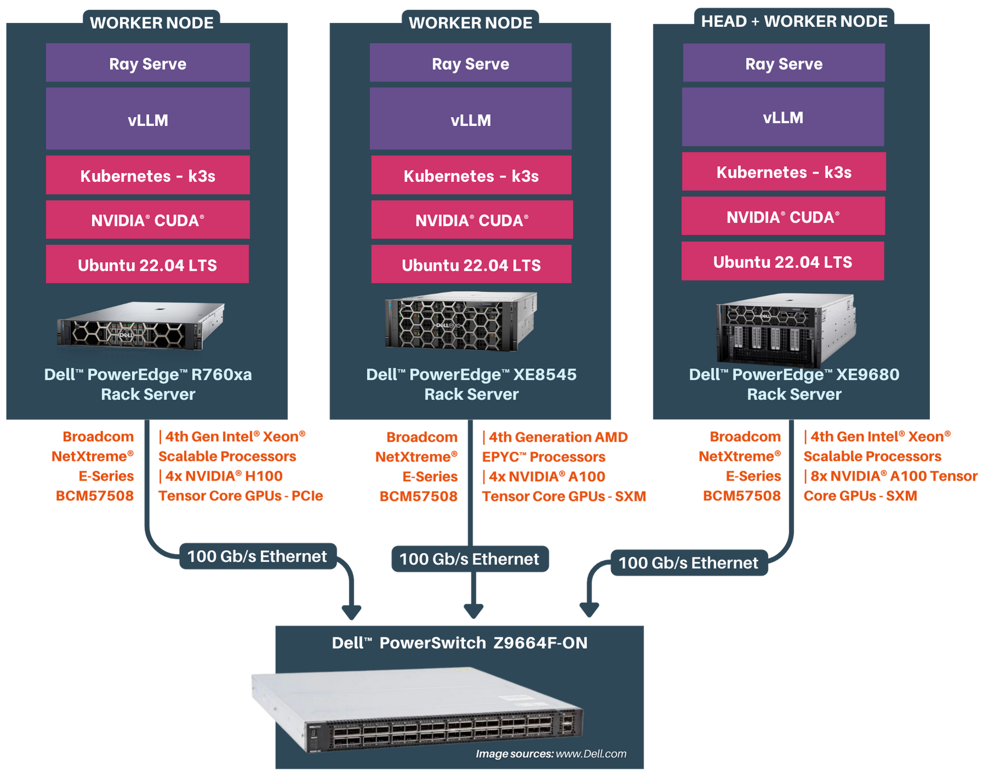

# Performance Testing for Distributed Inferencing

## 1. Introduction

Scalers AI has developed an LLM Distributed Inferencing solution that emphasizes simultaneous support for diverse language models, compatibility with multiple backends, and a hardware-agnostic design. This versatile solution allows users to efficiently deploy various models within a unified environment, optimizing performance based on specific requirements and hardware platforms.

### 1.1 Objective

* Evaluate the scalability of user initiated LLM inference requests with respect to scaling the nodes on the distributed inferencing cluster.
* Measure resource utilization under different concurrent user inferencing scenarios.

### 1.2 Scope

This methodology covers the testing of inferencing capabilities, resource utilization, and overall system performance of LLM models distributed across multiple nodes on Kubernetes environment.

## 2. Test Environment

### 2.1 Hardware Configuration

The Kubernetes cluster configuration used for the testing is as shown below

The cluster consists of three Dell PowerEdge servers
| Server | CPU | RAM | Disk | GPU |
| --- | --- | --- | --- | --- |
| Dell PowerEdge XE9680 | Intel(R) Xeon(R) Platinum 8480+ | 2 TB | 3TB | 8xNVIDIA A100 SXM 80GB GPUs |
| Dell PowerEdge XE8545 | AMD EPYC 7763 64-Core Processor | 1 TB | 2 TB | 4xNVIDIA A100 SXM 80GB GPUs |
| Dell PowerEdge R760xa | Intel(R) Xeon(R) Platinum 8480+ | 1 TB | 1 TB | 4xNVIDIA H100 PCIe 80GB GPUs |

Each server is networked to an Dell PowerSwitch Z9664F-ON through Broadcom BCM57508 NICs with 100 Gb/s bandwidth.

### 2.2 Software Configuration

#### 2.2.1 Kubernetes + Ray Cluster
| Software | Version |
| --- | ---- |
| [K3s](https://github.com/k3s-io/k3s/) | `v1.28.5+k3s1` |
| [Helm](https://github.com/helm/helm) | `v3.12.3` |
| [KubeRay](https://github.com/ray-project/kuberay) | `1.0.0` |
| [NVIDIA GPU Operator Kubernetes](https://docs.nvidia.com/datacenter/cloud-native/gpu-operator/latest/getting-started.html#operator-install-guide) | `v23.9.1` |

#### 2.2.2 Distributed Inference Docker Image
| Software | Version |
| --- | ---- |
| [Ray](https://github.com/ray-project/ray) | `2.8.1` |
| [Ray Serve](https://github.com/ray-project/ray) | `2.8.1` |
| [NVIDIA NGC PyTorch Image](https://catalog.ngc.nvidia.com/orgs/nvidia/containers/pytorch) | `23.10-py3` |
| [vLLM](https://github.com/vllm-project/vllm) | `0.2.6` |
| [GPUtil](https://github.com/anderskm/gputil) | `1.4.0` |

#### 2.2.3 Testing Stack
| Software | Version |
| --- | ---- |
| [Locust](https://github.com/locustio/locust) | `2.20.0` |

### 2.3 Large Language Model

| Model | Precision |
| --- | --- |
| [Llama 2 70B Chat HF](https://huggingface.co/meta-llama/Llama-2-70b-chat-hf) | `bfloat16` |

## 3. Test Scenarios

he Llama 2 70B Chat HF model is loaded with a tensor parallelism of 4 GPUs. A 70B model (Float 32 precision) requires ~260 GB of GPU memory to load the model. Based on the model weight GPU memory requirement and inference requirements, we recommend using 4x80GB GPUs to load a single Llama 2 70B Chat model.

We will be running the Llama 2 70B Chat model with bfloat16 precision for the tests.

### 3.1 Single Node Inferencing

The below table describes the single node inferencing hardware configuration with 4 GPUs (1 replica).

| Device | Node Type | GPU | GPU Count | CPU Cores |  Memory | Disk |
| --- | --- | --- | --- |--- |--- | --- |
| XE9680 | Head | - | - | 160 | 300 GB | 1 TB |
| XE8545 | Worker | NVIDIA A100 SXM 80GB | 4 | 160 | 300 GB | 1 TB |

### 3.2 Two Node Inferencing

Two scenarios for two node inferencing

#### Scenario  1: 8 GPUs, 2 Replicas

The below table describes the two node inferencing hardware configuration with 8 GPUs(2 replicas).

| Device | Node Type | GPU | GPU Count | CPU Cores |  Memory | Disk |
| --- | --- | --- | --- |--- |--- | --- |
| Dell PowerEdge XE9680 | Head | NVIDIA A100 SXM 80GB | 4 | 160 | 300 GB | 1 TB |
| Dell PowerEdge XE8545 | Worker | NVIDIA A100 SXM 80GB | 4 | 160 | 300 GB | 1 TB |

#### Scenario  2: 12 GPUs, 3 Replicas

The below table describes the two node inferencing hardware configuration with 12 GPUs(3 replicas).

| Device | Node Type | GPU | GPU Count | CPU Cores |  Memory | Disk |
| --- | --- | --- | --- |--- |--- | --- |
| Dell PowerEdge XE9680 | Head+Worker | NVIDIA A100 SXM 80GB | 8 | 160 | 300 GB | 1 TB |
| Dell PowerEdge XE8545 | Worker | NVIDIA A100 SXM 80GB | 4 | 160 | 300 GB | 1 TB |

### 3.3 Three Node Inferencing

The below table describes the two node inferencing hardware configuration with 16 GPUs(4 replicas).

| Device | Node Type | GPU | GPU Count | CPU Cores |  Memory | Disk |
| --- | --- | --- | --- |--- |--- | --- |
| Dell PowerEdge XE9680 | Head+Worker | NVIDIA A100 SXM 80GB | 8 | 160 | 300 GB | 1 TB |
| Dell PowerEdge XE8545 | Worker | NVIDIA A100 SXM 80GB | 4 | 160 | 300 GB | 1 TB |
| Dell PowerEdge R760xa | Worker | NVIDIA H100 PCIe 80GB | 4 | 160 | 300 GB | 1 TB |

## 4. Test Workload Configuration

The workload consists of a set of 1000+ prompts passed randomly for each test with different concurrent requests. The concurrent requests are generated by locust tool.

The inference configuration is as below
* Input token length: 14 to 40.
* Output token length: 256
* Temperature: 1

The tests were run with two different batch sizes per replica - 32 and 256.

## 5. Test Metrics

The below are the metrics measured for each tests

| Metric | Explanation |
| -- | ---- |
| Requests Per Second (RPS)| Evaluate system throughput, measuring requests processed per second. |
| Total Token Throughput (tokens/s) | Quantify language model efficiency by assessing token processing rate. |
| Request Latency (P50, P95, P99) | Gauge system responsiveness through different latency percentiles. |
| Average CPU, Memory, GPU Utilization | Assess system resource usage, including CPU, memory, and GPU. |
| Network Bandwidth (Average, Maximum) | Measure efficiency in data transfer with average and maximum network bandwidth. |

## 6. Performance Metrics

### 1. Scalability results for batch size of 32 per replica

| Inference Nodes | Devices | GPUs | Concurrent Requests |RPS | Tokens/s | P95 Latency(s) | P95 Token Latency(ms) |
| --- | --- | ---| --- | --- | ---| --- | --- |
| Single Node | Dell PowerEdge XE8545 | 4xNVIDIA A100 SXM 80GB | 32 | 2.7 | 621.4 | 13 | 50.78 |
| Two Nodes | Dell PowerEdge XE9680(4 GPUs)   Dell PowerEdge XE8545 | 8xNVIDIA A100 SXM 80GB | 64 | 4.8 | 1172.63 | 17 | 66.41 |
| Two Nodes | Dell PowerEdge XE9680   Dell PowerEdge XE8545 | 12xNVIDIA A100 SXM 80GB | 96 | 6.8 | 1551.94 | 17 | 66.4 |
| Three Nodes | Dell PowerEdge XE9680   Dell PowerEdge XE8545   Dell PowerEdge R760xa | 12xNVIDIA A100 SXM 80GB   4xNVIDIA H100 PCIe 80GB | 128 | 8.3 | 1868.76 | 17 | 66.4 |

### 2. Scalability results for batch size of 256 per replica

| Inference Nodes | Devices | GPUs | Concurrent Requests |RPS | Tokens/s | P95 Latency(s) | P95 Token Latency(ms) |
| --- | --- | ---| --- | --- | ---| --- | --- |
| Single Node | Dell PowerEdge XE8545 | 4xNVIDIA A100 SXM 80GB | 256 | 6.4 | 1475.64 | 45 | 175.78 |
| Two Nodes | Dell PowerEdge XE9680(4 GPUs)   Dell PowerEdge XE8545 | 8xNVIDIA A100 SXM 80GB | 512 | 10.3 | 2542.32 | 61 | 238.28 |
| Two Nodes | Dell PowerEdge XE9680   Dell PowerEdge XE8545 | 12xNVIDIA A100 SXM 80GB | 768 | 14.5 | 3222.89 | 64 | 250 |
| Three Nodes | Dell PowerEdge XE9680   Dell PowerEdge XE8545   Dell PowerEdge R760xa | 12xNVIDIA A100 SXM 80GB   4xNVIDIA H100 PCIe 80GB | 1024 | 17.5 | 4443.5 | 103 | 402.35 |
