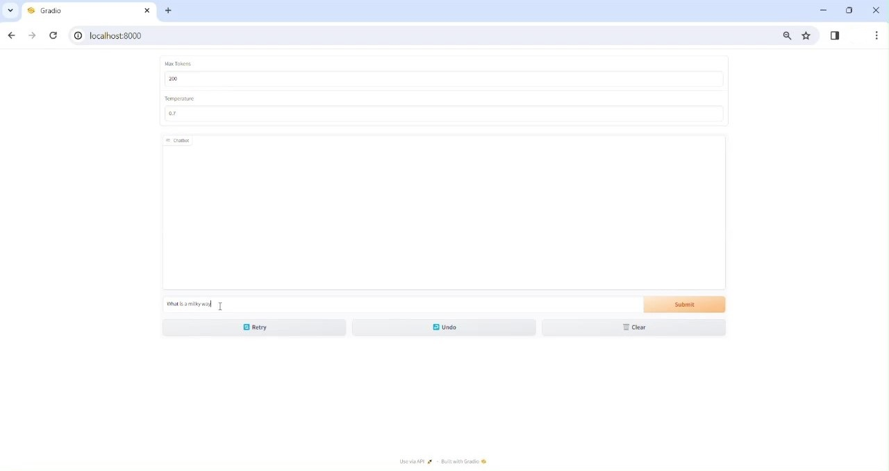

# Gradio Chatbot

This document states the steps to run the gradio chatbot with
the application endpoint for model serving.

## Table of Contents:

* [Prerequisites](#prerequisites)
* [Steps To Start the Chatbot](#steps-to-start-the-chatbot)
* [Accessing the Chatbot UI](#accessing-the-chatbot-ui)

## Prerequisites

After the ray cluster for CPU or GPU is operational, the application URL becomes accessible.
Refer the Ray Cluster documentation for additional information [here](../docs/raycluster_setup.md).

## Steps To Start the Chatbot

1.  Create a virtual environment
    ```bash
    python3 -m venv virtual
    ```

2. Activate the virtual environment
    ```bash
    source virtual/bin/activate
    ```

3. Install the requirements
    ```bash
    pip3 install -r requirements.txt
    ```

4. Run the python script
    ```bash
    python3 chatbot.py
    ```

The following are the configurations options
that are currently accepted for argument parser in `chatbot.py`

| Name | Description | Accepted values | Default value |
| --- | --- | --- | --- |
| host | The host on which to run the chatbot | `str` | `localhost` |
| port | The port on which to run the chatbot | `int` | `7860` |
| url | The application endpoint/ url where the LLM model is being served | `str` | `http://localhost:8000/gpu` |

These arguments can be passed as necessary when running the `chatbot.py` script

### Accessing the Chatbot UI

You can access the chatbot on the host and port that you specified while running the `chatbot.py` script.
For example, if you specified the port `8000` and host as `localhost`, you can access the chatbot
by accessing the url `localhost:8000` on a browser of your choice.

The following is a screenshot of the chatbot:


<figcaption style="text-align:justify; font-style:italic;">Fig 7. Chatbot UI</figcaption>


[Back to Detailed setup guide](../../README.md#detailed-set-up-guide)
